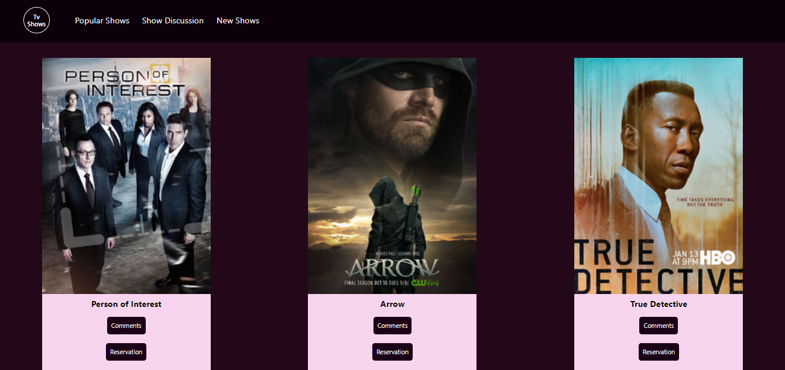
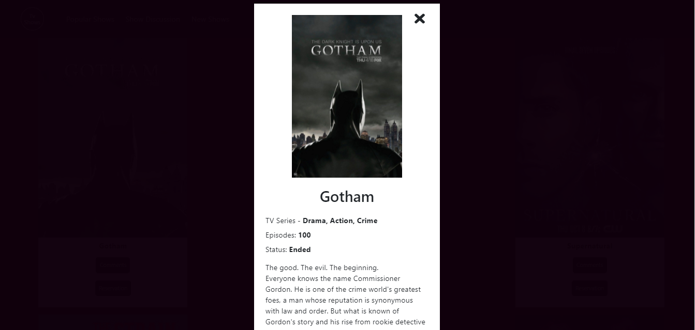

# Js Capstone

> In this project I'm practicing how to use RESTful API's. I'm using GET and POST methods to either display shows on the screen or to Display data that's related to the Involvement API that Microverse built for this learning project.

Basic UI of the project:

UI of the Pop Up:

## Built With

- Js
- Html
- Css

## Live Demo

[Live Demo Link](https://nelsinofrancisco.github.io/JSCapstone/)

## Project Description (Loom Video)

Check out the [video](https://www.loom.com/share/cfc64e65a3af494998491ee142811a67)

## Getting Started

To get a local copy up and running follow these simple example steps.

### Prerequisites

- Git/GitHub;
- Optional ( IDE installed in your machine ) - recommended IDE: Vscode;
- Node installed locally;

### Setup

- To clone this repo:
  - Open the Terminal(Mac/Linux) or the Cmd (Windows);
  - Navigate to where you want to paste the Repo folder;
  - Type `git clone https://github.com/nelsinofrancisco/leaderboard.git`;
  - Open the folder todo-list that was created on your IDE;

### Install

- To install all the dependencies in the package-lock.json:
  - Open the Terminal(Mac/Linux) or the Cmd (Windows);
  - Navigate to be inside the todo-list repo folder;
  - Run npm install or npm i;
  
### Run tests

- Linters Tests:
  - Eslint: run `npx eslint .`
  - Stylelint: run `npx stylelint "**/*.{css,scss}"`
  - WebHint: run `npx hint --telemetry=off .`
  - LightHouse: run `lhci autorun --upload.target=temporary-public-storage --collect.staticDistDir=.`
- Run a Live Version of the Dist Folder:
  - Run `npm start`
- To build the webpack:
  - Run `npm run build`

### Deployment

The Page is Deployed in the branch gh-pages;

## Authors

👤 **Author1**

- GitHub: [@nelsinofrancisco](https://github.com/nelsinofrancisco)
- Twitter: [@nelsino_s](https://twitter.com/nelsino_s)
- LinkedIn: [LinkedIn](https://www.linkedin.com/in/nelsino-francisco-de-souza-neto-ab60a7166/)

## 🤝 Contributing

Contributions, issues, and feature requests are welcome!

Feel free to check the [issues page](../../issues/).

## Show your support

Give a ⭐️ if you like this project!

## Acknowledges

@AdedayoOpeyemi for building the functions that display the shows, we could not finishing working together, but he did a great job on those functions!
## 📝 License

This project is [MIT](./MIT.md) licensed.
